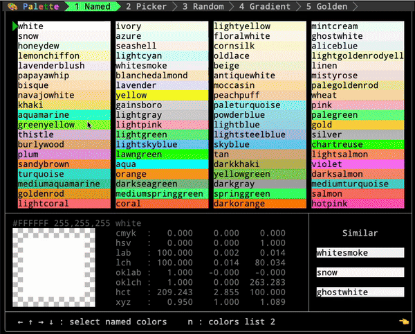
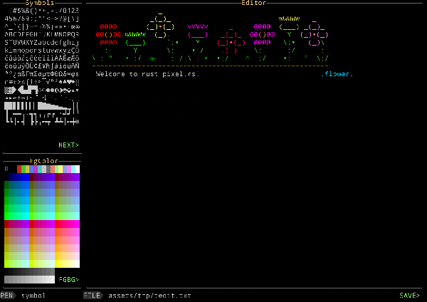
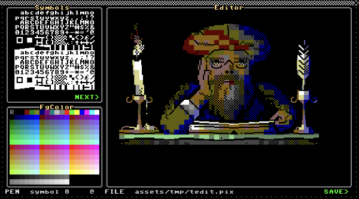
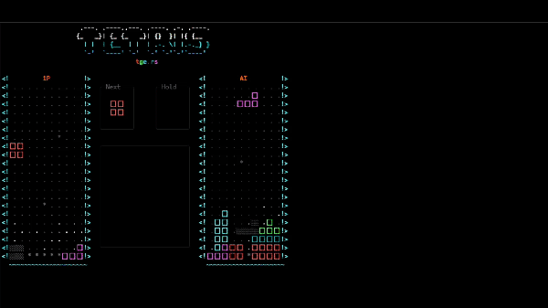
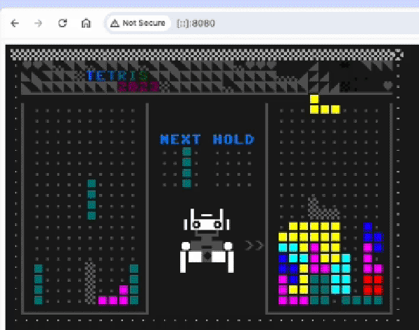
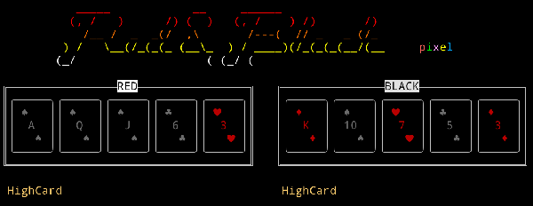

![License] [![Latest Version]][crates.io] ![Downloads] [![API Documentation]][docs.rs] ![MSRV]

[License]: https://img.shields.io/badge/license-Apache2.0-blue.svg
[Latest Version]: https://img.shields.io/crates/v/rust_pixel.svg
[crates.io]: https://crates.io/crates/rust_pixel
[Downloads]: https://img.shields.io/crates/d/rust_pixel.svg
[API Documentation]: https://docs.rs/rust_pixel/badge.svg
[docs.rs]: https://docs.rs/rust_pixel
[MSRV]: https://img.shields.io/badge/rust-1.71+-brightgreen.svg?&logo=rust

[Change Log]&nbsp;&nbsp; | &nbsp;&nbsp;[Coding]&nbsp;&nbsp; | &nbsp;&nbsp;[FAQ]&nbsp;&nbsp; | &nbsp;&nbsp;[TODO]

[Change Log]: doc/change.md
[Coding]: doc/coding.md
[FAQ]: doc/faq.md
[TODO]: doc/todo.md

RustPixel is a **2D game engine** & **rapid prototyping tools**, supporting both **text** and **graphical** rendering modes.<br>
It is suitable for creating **2D pixel-style games** and developing **terminal applications**.<br>
It can be compiled into **FFI** for front-end and back-end use, and into **WASM** for web projects.

- Text Mode: Built with **crossterm**, runs in the terminal, and uses **ASCII & Unicode Emoji** for drawing.
- Graphical Mode (SDL2): Built with **SDL2**, using **PETSCII & custom graphical symbols** for rendering.
- Graphical Mode (Web): Similar to the SDL2 mode, but the core logic is compiled into WASM and rendered using **WebGL** and **JavaScript** (refer to rust-pixel/web-template/pixel.js).

RustPixel implements game loops, a Model/Render common pattern, and a messaging mechanism to support the construction of small games. It also includes some common game algorithms and tool modules. Additionally, RustPixel comes with small games like Tetris, Tower, and Poker, which can serve as references for creating your own games and terminal applications. It also includes examples of wrapping core game algorithms into FFI and WASM.

#### !!! SPECIAL REMINDER !!!
If you have previously installed an old version before 4.0, you need to re-deploy the cargo-pixel tool.
Otherwise, terminal mode will not run...
```
cargo install --path tools/cargo-pixel --root ~/.cargo
```

#### Installation Guide
--- MacOS ---

**Install iTerm2 & Nerd Font**

For better terminal display, you need to install [iTerm2] and set it to dark background mode. 
```
Settings... > Profiles > Colors > Color presets... > Dark Background
```

You also need to install [DroidSansMono Nerd Font].
```
curl -sS https://webi.sh/nerdfont | sh
Settings... > Profiles > Text > Font > DroidSansMono Nerd Font
```

[iTerm2]: https://iterm2.com/
[DroidSansMono Nerd Font]: https://github.com/ryanoasis/nerd-fonts

**Install brew**
``` 
/bin/bash -c "$(curl -fsSL https://raw.githubusercontent.com/Homebrew/install/HEAD/install.sh)"
``` 

**Install rust**
``` 
curl --proto '=https' --tlsv1.2 -sSf https://sh.rustup.rs | sh
. "$HOME/.cargo/env"            # For sh/bash/zsh/ash/dash/pdksh
``` 

**Install wasm-pack**
```
curl https://rustwasm.github.io/wasm-pack/installer/init.sh -sSf | sh
```

**Install some dependent libraries and software**
``` 
brew install ffmpeg            # Used to convert gif to ssf sequence frame files(.ssf)
brew install sdl2
brew install sdl2_image
brew install sdl2_gfx
brew install sdl2_ttf
brew install sdl2_mixer
``` 

Tips: Missing path in LIBRARY_PATH environment variable<br>
The Homebrew package manager symlinks library to the directory /usr/local/lib. <br>
To use these libraries with Rust, you need to add it to the LIBRARY_PATH environment variable. <br>
The command echo $LIBRARY_PATH will tell you if /usr/local/lib is added. <br>
If it is missing, add the following to the ~/.bash_profile configuration file:
```
export LIBRARY_PATH="$LIBRARY_PATH:/usr/local/lib"
```
This will add the directory to the environment variable each time you start up a new Terminal window.


**Download RustPixel and deploy cargo-pixel**
``` 
git clone https://github.com/zipxing/rust_pixel
cd rust_pixel
cargo install --path tools/cargo-pixel --root ~/.cargo
``` 

#### Usage Instructions
``` 
cd rust_pixel
cargo pixel run snake term            #Run the snake game in terminal mode
cargo pixel r snake t                 #Run the snake game in terminal mode - shorthand
cargo pixel r tetris s                #Run the Tetris game in SDL window mode
cargo pixel r tower w                 #Run tower in web,visit http://localhost:8080/ in your browser
cargo pixel r tower w --webport 8081  #Change web server port
cargo pixel r tower w -r              #Run with release mode
``` 

You can also use cargo pixel to create your own game or app:
```
cargo pixel c games mygame           #Create mygame in ./games using games/template as a template
cargo pixel c apps myapp             #Create myapp in ./apps using games/template as a template
```
Creat a standalone app in some directory:
```
cargo pixel c .. myapp --standalone  #Create a standalone crate in ../myapp 
cd ../myapp 
cargo pixel r myapp t
cargo pixel r myapp s

```

RustPixel also includes several tools:
1. palette: A terminal-ui tool to generate, analyze, convert and manipulate colors.
```
cargo pixel r palette t -r
```
 

2. tedit: Used to edit character art assets, example:
``` 
#term mode
cargo pixel r tedit term assets/screen-shot/tedit.txt

#graphical mode
cargo pixel r tedit sdl assets/screen-shot/tedit.pix 
```
 
 

3. tpetii: Used to convert regular images into PETSCII character art, example:
```
cargo pixel r tpetii t assets/fire.png 40 40 -r > assets/fire.pix
# -r : build tpetii in release mode for high performance
```

4. Script to automatically convert gif images into PETSCII animations (ssf)
```
cargo pixel cg assets/sdq/fire.gif assets/sdq/fire.ssf 40 25 
```

#### Demo games
1. snake: A snake game with a cool PETSCII animations
```
#graphical mode
cargo pixel r snake s -r
```


``` 
#term mode
cargo pixel r snake t -r
```

```
#web mode
cargo pixel r snake w -r
#and visit http://localhost:8080/ in your browser
```

2. tetris: A Tetris game where you can play against AI
``` 
#term mode
cargo pixel r tetris t -r
```

 

```
#graphical mode
cargo pixel r tetris s -r
```


```
#web mode
cargo pixel r tetris w -r
#and visit http://localhost:8080/ in your browser
```



3. poker: Includes the core algorithms for Texas Hold'em and Gin Rummy
``` 
cargo pixel r poker t -r
cargo pixel r gin_rummy t -r
```
 
 

The poker/ffi directory demo how to wrap Rust algorithms into CFFI for use with other languages, showcasing C++ and Python calling poker_ffi
```
cd games/poker/ffi
make run
```
The poker/wasm directory demo how to wrap Rust algorithms into wasm for JS calling
```
cd games/poker/wasm
make run
```

4. tower: A tower defense game prototype demonstrating the use of objpool and pixel_sprite for pixel-perfect sprite movement
``` 
#graphical mode
cargo pixel r tower s -r

#web mode
cargo pixel r tower w -r
#and visit http://localhost:8080/ in your browser
```
 

and so on ... ...

